<!-- Generated by scripts/build.py — edit the content there and re-run. -->

<picture>
  <source media="(prefers-color-scheme: dark)" srcset="assets/hero-dark.svg">
  <source media="(prefers-color-scheme: light)" srcset="assets/hero-light.svg">
  
</picture>

<a href="https://www.linkedin.com/in/milansazdov"><picture>
  <source media="(prefers-color-scheme: dark)" srcset="assets/chip-linkedin-dark.svg">
  <source media="(prefers-color-scheme: light)" srcset="assets/chip-linkedin-light.svg">
  
</picture></a>
<a href="#projects"><picture>
  <source media="(prefers-color-scheme: dark)" srcset="assets/chip-projects-dark.svg">
  <source media="(prefers-color-scheme: light)" srcset="assets/chip-projects-light.svg">
  
</picture></a>

<picture>
  <source media="(prefers-color-scheme: dark)" srcset="assets/neofetch-dark.svg">
  <source media="(prefers-color-scheme: light)" srcset="assets/neofetch-light.svg">
  
</picture>

<picture>
  <source media="(prefers-color-scheme: dark)" srcset="assets/section-timeline-dark.svg">
  <source media="(prefers-color-scheme: light)" srcset="assets/section-timeline-light.svg">
  
</picture>

<pre>
2026.04 → now      <b>Backend Software Engineer</b> · Ominimo · Belgrade / Novi Sad
                   ├─ backend services for an automotive insurance-tech platform
                   ├─ secure high-volume REST APIs: driver, vehicle &amp; policy data
                   ├─ pricing algorithms &amp; validation rule engines in production
                   └─ schema design &amp; SQL query optimization for low-latency reads
                      stack: PHP · Laravel · SQL

2023.10 → now      <b>BSc Software Engineering &amp; IT</b> · <a href="https://ftn.uns.ac.rs">FTN, University of Novi Sad</a>
                   ├─ GPA 10.00 / 10.00
                   └─ DSA · OS · OOP · databases · networks · discrete math · stats

2019.09 → 2023.06  <b>Gymnasium "Jovan Jovanović Zmaj"</b> · specialized CS program
                   └─ GPA 5.00 / 5.00 · Vuk Karadžić Diploma · CS &amp; math diplomas
</pre>

<picture>
  <source media="(prefers-color-scheme: dark)" srcset="assets/section-projects-dark.svg">
  <source media="(prefers-color-scheme: light)" srcset="assets/section-projects-light.svg">
  
</picture>

<pre>
🥇 <a href="https://github.com/LazarSazdov/MATF-SUMA">matf-suma</a>                                             Python · LightGBM · XGBoost
   1st in quals · 6th in finals — Ominimo × SUMA Data Science Hackathon
   └─ reverse-engineers insurance pricing: LightGBM + XGBoost → Ridge stack

🥈 <a href="https://github.com/LazarSazdov/JB-plugin">auto-code-walker</a>                                           Java 21 · IntelliJ SDK
   2nd place, JetBrains Hackathon — AI-guided code tours inside IntelliJ IDEA
   └─ PSI symbol analysis · async OpenAI pipeline + LRU cache: ~75% faster

📂 <a href="https://github.com/MilanSazdov/NASP-key-value-engine">nasp-key-value-engine</a>                                                   C++17 · C
   LSM-tree NoSQL storage engine, built from scratch
   └─ WAL → Memtable → SSTable · compaction · Bloom · HyperLogLog · Merkle

📂 <a href="https://github.com/MarkoMile/zkml-dataset-proof">shielder-zkml</a>                                               Python · cryptography
   zero-knowledge provenance for ML datasets — verify data, never expose it
   └─ Merkle-tree commitments · digital signatures · decoupled verification

📂 <a href="https://github.com/kzi-nastava/mrs-team27-Lucky3">ride-hailing-platform</a>                                    Java · Angular · Android
   real-time ride-hailing: driver/passenger matching + live geo-tracking
   └─ Spring Boot + JWT · Angular web · native Android · WebSockets

📂 <a href="https://github.com/vedranbajic4/graph-structure-visualizer">graph-structure-visualizer</a>                                         Python · D3.js
   plugin-based graph platform: JSON / XML / RDF → live D3.js views
   └─ entry-point plugin discovery · 12 design patterns · 14-command CLI

📂 <a href="https://github.com/MilanSazdov/Night-Twin">night-twin</a>                                               FastAPI · React · OpenAI
   AI nightlife recommender that finds the night twin of your ideal night
   └─ GPT intent parsing · embeddings + structured matching · guardrails
</pre>

<code>ls -la ~/projects/.archive</code> &nbsp;·&nbsp; 2 earlier projects

<pre>
📂 <a href="https://github.com/MilanSazdov/search-engine-pdf">search-engine-pdf</a>                                               Python · NetworkX
   PDF search engine: trie index, graph ranking, boolean &amp; phrase queries
   └─ autocomplete · pagination · top-10 export with highlights · caching

📂 <a href="https://github.com/MilanSazdov/checkers-ai">checkers-ai</a>                                                       Python · Pygame
   checkers AI: minimax + alpha-beta pruning, adaptive depth up to 5
   └─ material / safety / mobility heuristics · transposition cache · &lt;5 s
</pre>

<picture>
  <source media="(prefers-color-scheme: dark)" srcset="assets/section-achievements-dark.svg">
  <source media="(prefers-color-scheme: light)" srcset="assets/section-achievements-light.svg">
  
</picture>

<pre>
🥇 1st     <a href="https://www.linkedin.com/feed/update/urn:li:activity:7399936174791884801/">DeFi Everywhere Hackathon 2025</a> ······························ Ethereum NS
🥇 1st     <a href="https://www.linkedin.com/posts/milansazdov_proggy-buggy-activity-7334573130612367360-JrUA">Proggy-Buggy Towel Contest 2025</a> ··························· DataArt · pro
🥇 1st     Ominimo × SUMA DS Hackathon · quals ······················· MATF Belgrade
🥈 2nd     <a href="https://www.linkedin.com/posts/milansazdov_jetbrains-intellijidea-java21-activity-7416544191381606401-u8Dp">JetBrains Hackathon</a> ··········································· JetBrains
🏁 finals  <a href="https://www.linkedin.com/posts/milansazdov_midnightcodecup-midnightcodecup2025-lucky3-activity-7353003971571048449-nFSq">Midnight Code Cup 2025 · World Finals</a> ··············· Recraft × JetBrains
           └─ 500+ teams from 50+ countries · one of two Serbian teams in the finals
🏅 4th     Bubble Cup 17 · Premier League finals ··············· Microsoft DC Serbia
🏅 6th     Ominimo × SUMA DS Hackathon · finals ······················ MATF Belgrade
⚡ onsite  <a href="https://vinacija.com/hackathon">Reputeo &amp; Yandex AI Hackathon 2025</a> ···························· AI Nation
</pre>

<picture>
  <source media="(prefers-color-scheme: dark)" srcset="assets/section-honors-dark.svg">
  <source media="(prefers-color-scheme: light)" srcset="assets/section-honors-light.svg">
  
</picture>

<pre>
◆ <a href="https://sr.studenica.org/">Studenica Foundation Scholarship</a> ··················· highly selective, merit-based
◆ <a href="https://www.evrozaznanje.rs/">"Evro za znanje" Scholarship</a> ································· extremely selective
◆ Vuk Karadžić Diploma ·························· highest national high-school honor
◆ "Zlatna stolica" · Golden Seat ··········· KK Partizan × EuroLeague, for academics
◆ <a href="https://www.linkedin.com/posts/milansazdov_zk-zkml-dataprovenance-activity-7361753009602621440-9MJn">Petnica Science Center · Web3 Camp</a> ········· 10-day intensive: Web3 dev &amp; security
◆ <a href="https://matematickaakademija.com/zkp-kurs/">Zero-Knowledge Proofs course</a> ································ Mathematical Academy
◆ Center for Young Talents, Novi Sad ··················· excellence in C, math &amp; web
◆ Math &amp; programming competitions ·················· municipal → national, 2019–2023
</pre>

<picture>
  <source media="(prefers-color-scheme: dark)" srcset="assets/section-activity-dark.svg">
  <source media="(prefers-color-scheme: light)" srcset="assets/section-activity-light.svg">
  
</picture>

<picture>
  <source media="(prefers-color-scheme: dark)" srcset="https://raw.githubusercontent.com/MilanSazdov/MilanSazdov/output/snake-dark.svg">
  <source media="(prefers-color-scheme: light)" srcset="https://raw.githubusercontent.com/MilanSazdov/MilanSazdov/output/snake-light.svg">
  
</picture>

<picture>
  <source media="(prefers-color-scheme: dark)" srcset="assets/footer-dark.svg">
  <source media="(prefers-color-scheme: light)" srcset="assets/footer-light.svg">
  
</picture>

  

