<!-- Generated by scripts/build.py — edit the content there and re-run. -->

<picture>
  <source media="(prefers-color-scheme: dark)" srcset="assets/hero-dark.svg">
  <source media="(prefers-color-scheme: light)" srcset="assets/hero-light.svg">
  
</picture>

<picture>
  <source media="(prefers-color-scheme: dark)" srcset="assets/neofetch-dark.svg">
  <source media="(prefers-color-scheme: light)" srcset="assets/neofetch-light.svg">
  
</picture>

<picture>
  <source media="(prefers-color-scheme: dark)" srcset="assets/timeline-dark.svg">
  <source media="(prefers-color-scheme: light)" srcset="assets/timeline-light.svg">
  
</picture>

<picture>
  <source media="(prefers-color-scheme: dark)" srcset="assets/section-projects-dark.svg">
  <source media="(prefers-color-scheme: light)" srcset="assets/section-projects-light.svg">
  
</picture>
<a href="https://github.com/LazarSazdov/MATF-SUMA#gh-dark-mode-only"></a><a href="https://github.com/LazarSazdov/MATF-SUMA#gh-light-mode-only"></a>
<a href="https://github.com/LazarSazdov/JB-plugin#gh-dark-mode-only"></a><a href="https://github.com/LazarSazdov/JB-plugin#gh-light-mode-only"></a>
<a href="https://github.com/MilanSazdov/NASP-key-value-engine#gh-dark-mode-only"></a><a href="https://github.com/MilanSazdov/NASP-key-value-engine#gh-light-mode-only"></a>
<a href="https://github.com/MarkoMile/zkml-dataset-proof#gh-dark-mode-only"></a><a href="https://github.com/MarkoMile/zkml-dataset-proof#gh-light-mode-only"></a>
<a href="https://github.com/kzi-nastava/mrs-team27-Lucky3#gh-dark-mode-only"></a><a href="https://github.com/kzi-nastava/mrs-team27-Lucky3#gh-light-mode-only"></a>
<a href="https://github.com/vedranbajic4/graph-structure-visualizer#gh-dark-mode-only"></a><a href="https://github.com/vedranbajic4/graph-structure-visualizer#gh-light-mode-only"></a>
<a href="https://github.com/MilanSazdov/Night-Twin#gh-dark-mode-only"></a><a href="https://github.com/MilanSazdov/Night-Twin#gh-light-mode-only"></a>

<code>ls -la ~/projects/.archive</code> &nbsp;·&nbsp; 2 earlier projects

 

<a href="https://github.com/MilanSazdov/search-engine-pdf#gh-dark-mode-only"></a><a href="https://github.com/MilanSazdov/search-engine-pdf#gh-light-mode-only"></a>
<a href="https://github.com/MilanSazdov/checkers-ai#gh-dark-mode-only"></a><a href="https://github.com/MilanSazdov/checkers-ai#gh-light-mode-only"></a>

<picture>
  <source media="(prefers-color-scheme: dark)" srcset="assets/achievements-dark.svg">
  <source media="(prefers-color-scheme: light)" srcset="assets/achievements-light.svg">
  
</picture>

<picture>
  <source media="(prefers-color-scheme: dark)" srcset="assets/honors-dark.svg">
  <source media="(prefers-color-scheme: light)" srcset="assets/honors-light.svg">
  
</picture>

<picture>
  <source media="(prefers-color-scheme: dark)" srcset="assets/section-activity-dark.svg">
  <source media="(prefers-color-scheme: light)" srcset="assets/section-activity-light.svg">
  
</picture>
<picture>
  <source media="(prefers-color-scheme: dark)" srcset="https://raw.githubusercontent.com/MilanSazdov/MilanSazdov/output/snake-dark.svg">
  <source media="(prefers-color-scheme: light)" srcset="https://raw.githubusercontent.com/MilanSazdov/MilanSazdov/output/snake-light.svg">
  
</picture>

<picture>
  <source media="(prefers-color-scheme: dark)" srcset="assets/footer-dark.svg">
  <source media="(prefers-color-scheme: light)" srcset="assets/footer-light.svg">
  
</picture>

  

